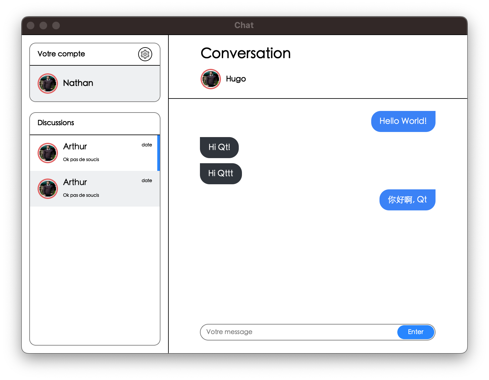

# ChatApp for Qt

- [Figma 设计稿 ChatApp](https://www.figma.com/file/HKNt3P6TkZBKr8AIR66Okh/Chat-App-(Community)?type=design&node-id=59-2&mode=design&t=TA72TXZ1kFIuAaqD-0)

## Env

- Qt6.7
- QWidget
- Mac

## Description

还原设计稿内容, 使用 Qt 进行渲染

实现功能:

- 账户信息
- 消息列表
  - 点击切换聊天用户
- 消息栏
  - 交谈人信息
  - 历史消息
  - 消息输入框
  - 消息发送按钮 (回车事件捕捉)

